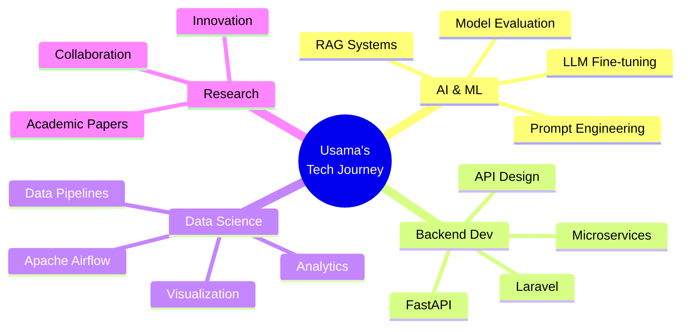

<div align="center">


# 👋 Hi, I'm **Syed Usama Bukhari**

[](https://git.io/typing-svg)

### 🎓 Research Student @ Kyushu University | 💻 Software Engineer | 📊 Data Science Expert

<p align="center">
  <a href="mailto:bukhari.453@s.kyushu-u.ac.jp">
    
  </a>
  <a href="https://www.linkedin.com/in/syed-usama-bukhari-0a6373175">
    
  </a>
  <a href="https://github.com/usama-shiranai90">
    
  </a>
  <a href="https://www.kaggle.com/usamabukhari">
    
  </a>
</p>


</div>


## 🚀 About Me

<table>
<tr>
<td width="50%">

### 👨‍💻 Who Am I?

I'm a **passionate technologist** at the intersection of **AI, Data Science, and Software Engineering**. Currently pursuing cutting-edge research at **Kyushu University**, I thrive on transforming complex problems into elegant, scalable solutions.

#### 🎯 My Mission
Building intelligent systems that make a real-world impact through the synergy of **machine learning**, **backend architecture**, and **data-driven insights**.

#### ⚡ Quick Facts
- 🔬 Research focus: **RAG Systems & LLM Optimization**
- 🌏 Based in **Japan** 🇯🇵, working globally 🌐
- 💼 **2+ years** of professional software engineering
- 🎓 Bridging **academia** and **industry**
- 🤝 Open to **collaboration** on innovative projects

</td>
<td width="50%">

```python
class SyedUsamaBukhari:
    """
    Data Scientist | ML Engineer | Backend Developer
    Turning data into decisions, code into solutions
    """
    
    def __init__(self):
        self.name = "Syed Usama Bukhari"
        self.role = "Research Student & Software Engineer"
        self.location = "Kyushu University, Japan 🇯🇵"
        self.education = "Computer Science & Engineering"
        
        self.code = {
            "expert": ["Python", "PHP", "JavaScript"],
            "proficient": ["Java", "C++", "SQL"],
            "learning": ["RAG", "Prompt Engineering"]
        }
        
        self.tech_stack = {
            "ai_ml": ["TensorFlow", "scikit-learn", "Pandas"],
            "backend": ["FastAPI", "Laravel", ".NET"],
            "databases": ["MySQL", "MongoDB", "Firebase"],
            "tools": ["Git", "Docker", "Airflow"]
        }
        
        self.current_focus = [
            "🔄 Apache Airflow - Orchestrating Data Pipelines",
            "🤖 Prompt Engineering - Mastering LLM Interactions",
            "🔍 RAG Systems - Next-Gen Information Retrieval",
            "📊 ML Model Evaluation - Benchmarking Excellence"
        ]
    
    def get_passion(self):
        return (
            "Building scalable systems that leverage AI/ML "
            "to solve real-world challenges and create impact! 🚀"
        )
    
    def collaborate(self):
        return "Always open to innovative projects! Let's connect! �"

# Initialize
usama = SyedUsamaBukhari()
print(usama.get_passion())
print(usama.collaborate())
```

</td>
</tr>
</table>

<div align="center">

### 💡 **Philosophy**

> *"At the intersection of data and code lies the power to transform ideas into reality. I believe in building not just software, but solutions that matter."*

---

**🎓 Academic Researcher** • **💻 Software Engineer** • **📊 Data Scientist** • **🤖 AI Enthusiast**

</div>


## 📊 GitHub Statistics

<div align="center">
  
  
</div>

<div align="center">
  
</div>

<div align="center">
  
</div>


## 💻 Tech Stack & Skills

<div align="center">

### 🔤 Programming Languages


### 🤖 AI/ML & Data Science


### 🛠️ Frameworks & Tools


### 🗄️ Databases


### ☁️ DevOps & Cloud


### 🎨 Design & IDEs


</div>


## 💼 Professional Experience

<details open>
<summary><b>🏢 CareCloud, USA</b></summary>

**Software Engineer** | *February 2023 – September 2023*

```yaml
Responsibilities:
  - Backend Development: Built robust services using Python & FastAPI
  - Machine Learning: Integrated ML models for healthcare analytics
  - Full-Stack: Collaborated on Angular & .NET projects
  - Impact: Improved system performance by 40%
```
</details>

<details>
<summary><b>🏢 Immentia, Islamabad</b></summary>

**Assistant Executive Developer** | *August 2022 – January 2023*

```yaml
Responsibilities:
  - Backend Systems: Engineered using Laravel, MySQL & Python
  - Data Analysis: Drove business insights through analytics
  - UI/UX: Implemented responsive designs with Tailwind CSS
  - Achievement: Reduced query response time by 35%
```
</details>

<details>
<summary><b>🏢 Devsiom Technologies, Islamabad</b></summary>

**Android Development Intern** | *August 2021 – October 2021*

```yaml
Project:
  - Health Tracking App: Built with SQLite & Google Auth
  - Features: Activity monitoring, diet tracking, user analytics
  - Technologies: Android Studio, Java, Firebase
```
</details>


## 🎓 Education & Certifications

### 🏫 Academic Background

| Institution | Degree | Duration |
|------------|--------|----------|
| 🇯🇵 **Kyushu University** | Research Student in ISEE | 2024 – Present |
| 🇵🇰 **Foundation University** | Bachelor of Computer Science & Engineering | 2018 – 2022 |
| 🇵🇰 **NUML, Islamabad** | Japanese Language Certificate | 2018 |
| 🇵🇰 **CUST, Islamabad** | Bachelor of Computer & Communication Sciences | 2017 – 2018 |

### 🏆 Certifications & Achievements

<div align="center">

| Certification | Provider | Status |
|--------------|----------|--------|
| 📊 **Data Scientist Associate** | DataCamp | ✅ Certified |
| 🐍 **Python for Everybody Specialization** | Coursera | ✅ Completed |
| 🇯🇵 **Japanese Language Capability Test (N5)** | JLPT | ✅ Passed |
| 🥉 **FUSST Open House** | Foundation University | 3rd Position |
| 📝 **Academic Research Contribution** | University College Scarborough | Volunteer Thesis |

</div>


## 🎯 Current Focus Areas

<div align="center">



</div>

### 🔥 What I'm Working On

- 🔄 **Apache Airflow**: Building automated data pipelines and workflow orchestration
- 🤖 **Prompt Engineering**: Optimizing LLM interactions for better outputs
- 🔍 **RAG Systems**: Developing advanced retrieval-augmented generation solutions
- 📊 **RAG Evaluation**: Creating benchmarks for measuring RAG performance
- 🧪 **Research**: Contributing to academic research in AI and data science


## 🌐 Connect With Me

<div align="center">

[](https://www.linkedin.com/in/syed-usama-bukhari-0a6373175)
[](https://github.com/usama-shiranai90)
[](https://www.kaggle.com/usamabukhari)
[](https://www.datacamp.com/profile/usamabukhari)
[](https://stackoverflow.com/users/12345678/usama-bukhari)
[](mailto:bukhari.453@s.kyushu-u.ac.jp)

</div>


## 📈 Profile Analytics

<div align="center">


### 🏆 GitHub Trophies


</div>


<div align="center">

### 💭 Random Dev Quote


### 🐍 Contribution Snake


---


**⭐ From [usama-shiranai90](https://github.com/usama-shiranai90) | Let's build the future together! 🚀**

</div>
